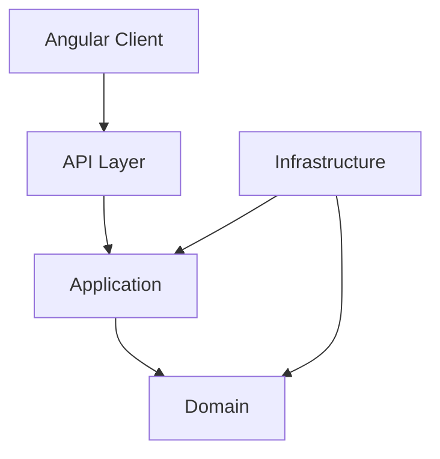

# User Management System (Prueba Técnica)

This is a robust Full-Stack User Management solution built with **.NET 8** and **Angular 17+**.
It demonstrates **Clean Architecture**, **Domain-Driven Design (DDD)**, **CQRS**, and modern frontend practices.

## 🚀 Features

### Backend (.NET 8)
- **Architecture**: Clean Architecture (Domain, Application, Infrastructure, API).
- **Patterns**: CQRS (using MediatR), Repository Pattern, Dependency Injection.
- **Data**: Entity Framework Core with **SQLite** (configured for easy portability).
- **Core Concepts**: 
  - DDD (Entities, Value Objects).
  - Inheritance (`AdminUser` vs `StandardUser`).
  - RESTful API endpoints.

### Frontend (Angular)
- **Architecture**: Modular design (Core, Shared, Features).
- **Performance**: Lazy Loading for feature modules.
- **Components**: Modern **Standalone Components**.
- **State**: Smart (Container) / Dumb (Presentational) component pattern.
- **Styling**: Premium **Vanilla CSS** (variables, flexbox) without external UI libraries.
- **Features**: 
  - Create Random Users.
  - View User List.
  - **Edit & Delete** Users (Full CRUD).

## 🛠️ Getting Started

### Prerequisites
- [.NET 8 SDK](https://dotnet.microsoft.com/download/dotnet/8.0)
- [Node.js](https://nodejs.org/) (LTS)
- [Angular CLI](https://angular.io/cli)

### 1. Backend Setup
The backend uses **SQLite**, so no external SQL Server installation is required.

1. Navigate to the root directory.
2. Run the application:
   ```bash
   dotnet run --project src/UserManagement.Api/UserManagement.Api.csproj
   ```
   *The database `UserManagement.db` will be automatically created and migrated on startup if configured, or you can run `dotnet ef database update`.*

   The API will start at: `http://localhost:5050`

### 2. Frontend Setup
1. Open a new terminal.
2. Navigate to the client folder:
   ```bash
   cd user-management-client
   ```
3. Install dependencies:
   ```bash
   npm install
   ```
4. Start the application:
   ```bash
   npm start
   ```
5. Open your browser at: `http://localhost:4200`

## 🧪 Architecture Overview



## 📝 License
This project is for educational/technical assessment purposes.
